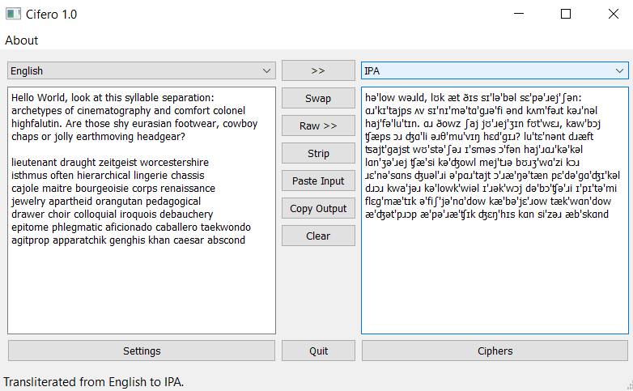
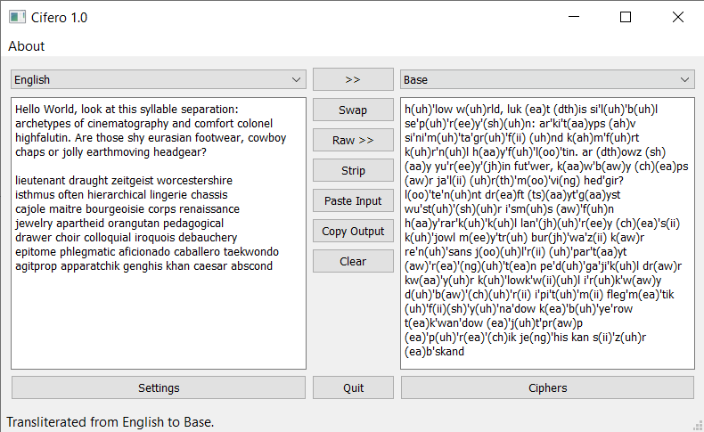
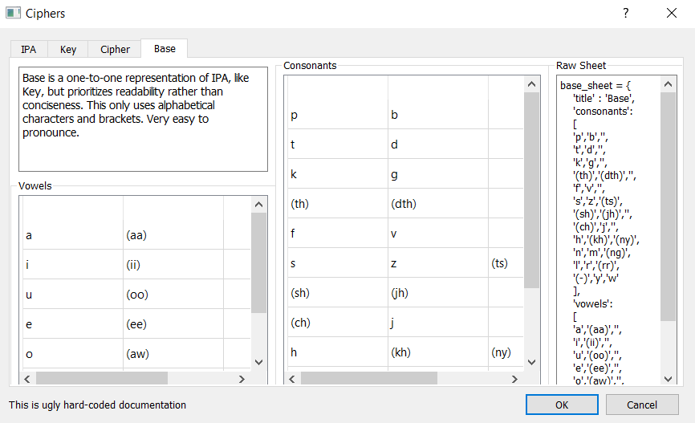

# cifero

A personal Python GUI (PyQt5) program for phonetic transliteration and
syllable separation. It transliterates sentences to and from: dictionary
English, IPA, a "typable" IPA, a "readable" IPA, and a phonetic cipher.
Currently punctuation is a problem.

## Running the program

To run without installing anything, Windows/Linux executables are in
"releases".

### Running from source

Run the following commands at the root of the repo,
in a virtual environment (conda/venv), or otherwise:

```_
pip install .

python cifero
```

This requires/installs PyQt5, which is very large (> 200MB).

## Screenshots




